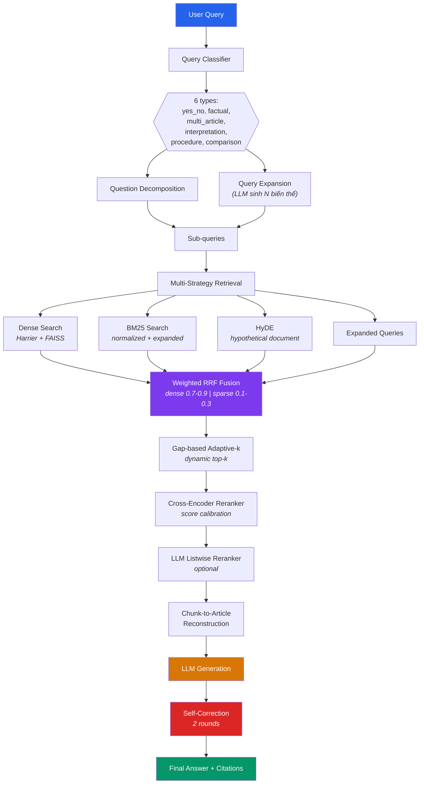
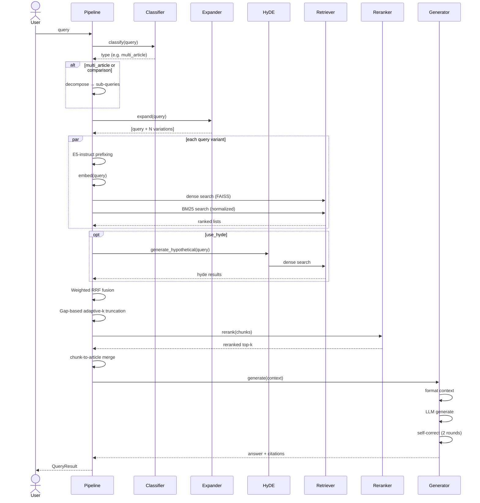
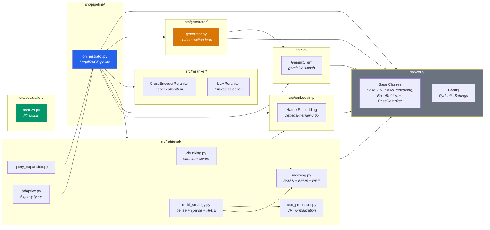

# Legal RAG — AI LEGAL ASSISTANT

> Hệ thống **Retrieval-Augmented Generation** cho luật pháp Việt Nam.
> Hỗ trợ suy luận tốc độ cao với Qwen3-8B và vLLM.

---

## Kiến trúc tổng quan



**Pipeline orchestrator:** `src/pipeline/orchestrator.py`

### Luồng xử lý chi tiết (một query)



## Khởi chạy Hệ thống (Local / Docker)

Dự án hỗ trợ chạy inference tốc độ cao thông qua **vLLM** với mô hình **Qwen3-8B**.

### Cấu hình Yêu cầu
- OS: Linux/Windows (WSL)
- GPU: Tối thiểu 16GB VRAM để chạy Native FP16 (hoặc 2x T4 GPU 16GB trên Kaggle).
- RAM: 32GB+
- CUDA: 12.1+

### Bước 1: Build Docker Image
```bash
docker build -t r2ai_legal_submission .
```

Bước này sẽ tải base image, cài đặt `vllm`, `transformers` và các thư viện cần thiết trong `requirements.txt`.

### Bước 2: Tải Mô hình Offline
Đảm bảo bạn đã chạy script tải weights về thư mục nội bộ (data/models):
```bash
python scripts/download_models.py
```

### Bước 3: Chạy Suy Luận
```bash
docker run --gpus all -v $(pwd)/data:/app/data r2ai_legal_submission
```

### Kiến trúc component



---

## Cài đặt

### 1. Clone repository

```bash
git clone <repo-url>
cd D:\AI_RAG_LEGAL
```

### 2. Môi trường

Sử dụng **conda** (khuyên dùng):

```bash
conda create -n rag python=3.11
conda activate rag
pip install -r requirements.txt
```

Hoặc nếu đã có sẵn env `rag`:

```bash
conda activate rag
pip install -r requirements.txt
```

### 3. Biến môi trường

Tạo file `.env` trong thư mục gốc:

```env
GOOGLE_API_KEY=your_gemini_api_key_here
GEMINI_MODEL=gemini-2.0-flash
EMBEDDING_MODEL=mainguyen9/vietlegal-harrier-0.6b
RERANKER_MODEL=AITeamVN/Vietnamese_Reranker
DEVICE=cpu
```

### 4. Dependencies

Xem `requirements.txt` hoặc `pyproject.toml`:

```
pip install google-genai torch transformers faiss-cpu rank-bm25 \
            numpy scikit-learn scipy datasets tqdm pydantic-settings
```

---

## Hướng dẫn sử dụng

Có **2 môi trường chạy**, dùng cho 2 mục đích khác nhau:

| Môi trường | Dùng để | LLM | Hợp lệ thi? |
|-----------|---------|-----|-------------|
| **Local (máy cá nhân)** | Dev, test nhanh phần retrieval/IR | Gemini API (prototyping) | ❌ Không (model đóng) |
| **Kaggle GPU T4×2** | Chạy thật + sinh submission | Qwen (HF, offline) | ✅ Có |

> ⚠️ **Lưu ý hợp lệ:** Cuộc thi **cấm model đóng** (Gemini/GPT/Claude) và yêu cầu **< 14B tham số**. Bản local mặc định gọi `Gemma4Client` qua Google API → **chỉ để prototype**. Bài nộp chính thức **phải** chạy nhánh `HFClient` (Qwen) offline trên Kaggle.

---

### A. Chuẩn bị môi trường (chạy 1 lần)

```bash
# Python 3.11+ (đã test trên 3.13). Khuyến nghị conda:
conda create -n rag python=3.11 && conda activate rag
pip install -r requirements.txt

# Để chạy LLM Qwen 4-bit (chỉ cần khi sinh câu trả lời / submission):
pip install accelerate bitsandbytes
```

Tạo `.env` ở thư mục gốc (xem `.env.example`). Trên máy có GPU NVIDIA đặt `DEVICE=cuda`, nếu không đặt `DEVICE=cpu`.

---

### B. Test nhanh RETRIEVAL trên máy local (KHÔNG cần LLM)

Đây là cách nhanh nhất để kiểm tra hệ thống và phần IR (truy hồi điều luật — phần được chấm F2-Macro). Script này **dùng index thật đã build sẵn** trong `data/indexes/`, đọc corpus theo offset nên **không nạp toàn bộ vào RAM** (chạy được với máy ~8 GB GPU / 16 GB RAM):

```bash
# Windows (đảm bảo in được tiếng Việt):
set PYTHONIOENCODING=utf-8
python scripts/test_retrieval.py
```

Script `scripts/test_retrieval.py` thực hiện:
1. Build bảng byte-offset cho `corpus.jsonl` (~10s, không tốn RAM)
2. Nạp FAISS dense (mmap) + BM25 sparse + Harrier embedder + Cross-Encoder reranker
3. Với mỗi câu hỏi mẫu: **Dense + BM25 → RRF fusion → Cross-Encoder rerank** → in ra danh sách điều luật liên quan (`relevant_articles`)

Sửa list `QUERIES` trong file để thử câu hỏi của bạn.

Test riêng BM25 (đã fix, không cần index dense):

```bash
set PYTHONIOENCODING=utf-8
python scripts/test_bm25.py
```

> ✅ **Đã sửa (2026-06-23):**
> - **BM25 search** (`src/retrieval/indexing.py`): `bm25s.retrieve()` trả `(indices, scores)` nhưng code unpack ngược → điểm sai, lấy nhầm văn bản. Đã sửa, BM25 giờ trả kết quả đúng — **không cần build lại**.
> - **Dense embedding** (`src/embedding/harrier_embedding.py`): đổi **CLS pooling → last-token pooling** (vì `vietlegal-harrier-0.6b` là `Qwen3Model` decoder). Kiểm chứng bằng `scripts/verify_embedding.py`.
>
> ⏳ **Còn lại — bắt buộc trước khi nộp:** Index `data/indexes/dense.index` vẫn được encode bằng pooling CŨ → **phải build lại trên Kaggle** bằng `kaggle_build_indexes.ipynb` (đã vá đúng pooling). Tới lúc đó nhánh dense trong `scripts/test_retrieval.py` mới chính xác; hiện BM25-only đã đủ tốt.

---

### C. Chạy đầy đủ + sinh submission (trên Kaggle — bản hợp lệ)

Chạy lần lượt 3 notebook (đã cấu hình offline, không cần API key):

1. **`kaggle_build_indexes.ipynb`** — upload `corpus.jsonl` làm Kaggle Dataset → build FAISS + BM25 trên GPU. Tải `dense.index` + `sparse/` về.
2. **`kaggle_pipeline.ipynb`** — nạp corpus + index + models (Harrier, Reranker, **Qwen offline**), chạy pipeline agentic + eval F2-Macro.
3. **`kaggle_eval.ipynb`** — đánh giá trên tập kiểm thử.

Assets đóng gói thành Kaggle Dataset `ai-rag-legal-assets` gồm `corpus.zip` + `indexes.zip` + `src.zip` (xem `scripts/prepare_kaggle_assets.py`).

**Sinh file nộp** (`results.json` → `submission.zip`) theo định dạng cuộc thi:

```bash
python scripts/submit.py        # đọc test_set.json → chạy pipeline → xuất submission.zip
```

---

### D. Chạy 1 câu hỏi full pipeline (local, prototyping — cần Gemini key hoặc Qwen)

```python
import asyncio
from pathlib import Path
from src.data.loading import load_corpus
from src.pipeline.orchestrator import LegalRAGPipeline
from src.core.config import config

async def main():
    docs = load_corpus()                       # ⚠️ nạp full corpus ~1M chunk → cần RAM lớn
    pipeline = await LegalRAGPipeline.create(
        docs=docs,
        dense_path=str(Path(config.INDEX_DIR) / "dense.index"),
        sparse_path=str(Path(config.INDEX_DIR) / "sparse"),
    )
    result = await pipeline.answer("Người lao động có được hưởng lương thử việc không?")
    print(result.final_answer)
    print("Điều luật liên quan:", result.relevant_articles)

asyncio.run(main())
```

> Cách này nạp **toàn bộ corpus + index vào RAM** (>10 GB) nên nặng trên máy local — ưu tiên chạy trên Kaggle. Để test nhanh trên local, dùng **mục B**.

---

## Cấu trúc project

```
D:\AI_RAG_LEGAL\
├── src/
│   ├── core/               # Base classes, config, data contracts
│   │   ├── base.py         # Abstract base classes (Adapter pattern)
│   │   └── config.py       # Pydantic settings
│   ├── data/
│   │   └── loading.py      # Load dataset, chunk, save JSONL
│   ├── embedding/
│   │   └── harrier_embedding.py  # vietlegal-harrier-0.6b
│   ├── llm/
│   │   └── gemini_client.py      # Gemini adapter (prototyping)
│   ├── retrieval/
│   │   ├── adaptive.py           # Query classification + adaptive config
│   │   ├── chunking.py           # Legal structure-aware chunking
│   │   ├── hyde.py               # Hypothetical Document Embedding
│   │   ├── indexing.py           # FAISS + BM25 + weighted RRF
│   │   ├── multi_strategy.py     # Multi-strategy + gap-based adaptive-k
│   │   ├── query_expansion.py    # LLM-based query expansion
│   │   └── text_processor.py     # Vietnamese text normalization
│   ├── reranker/
│   │   └── cross_encoder.py      # Cross-encoder + LLM listwise reranker
│   ├── generator/
│   │   └── generator.py          # Generation + self-correction loop
│   ├── pipeline/
│   │   └── orchestrator.py       # Pipeline orchestrator
│   └── evaluation/
│       └── metrics.py            # F2-Macro, Recall@k, Precision@k
├── scripts/
│   └── run_pipeline.py           # Entry point
├── data/
│   ├── raw/                      # Raw data
│   ├── processed/                # Chunked corpus (JSONL)
│   ├── indexes/                  # FAISS + BM25 indexes
│   └── results/                  # Evaluation outputs
├── docs/
│   ├── 01_DATA.md                # Data sources & chunking
│   ├── 02_RETRIEVAL_MODEL.md     # Embedding models
│   ├── 03_RERANKER_MODEL.md      # Reranker models
│   ├── 04_GENERATION_MODEL.md    # LLM models
│   └── ARCHITECTURE.md           # Full architecture documentation
├── research/                     # 12 cloned open-source repos
├── pyproject.toml
├── requirements.txt
├── .env                          # API keys (not committed)
└── README.md
```

---

## Components

### Core (`src/core/`)
- **Adapter pattern**: `BaseLLM`, `BaseEmbedding`, `BaseRetriever`, `BaseReranker` — mỗi component có abstract base class, dễ dàng swap implementation
- **6 query types**: `yes_no`, `factual`, `multi_article`, `interpretation`, `procedure`, `comparison`

### Retrieval (`src/retrieval/`)
- **Multi-strategy**: Dense (FAISS) + Sparse (BM25) + HyDE + Query Expansion
- **Weighted RRF**: Dense weight=0.7-0.9, Sparse weight=0.1-0.3 (tùy query type)
- **Gap-based adaptive-k**: Tự động tìm score gap để cắt top-k
- **E5-instruct prefix**: Query được prefix với task instruction trước khi embed
- **Vietnamese text normalization**: NFKC normalization, legal abbreviation expansion, stopword removal

### Reranker (`src/reranker/`)
- **Cross-encoder**: Score calibration (softmax + minmax), threshold >0.95
- **LLM listwise reranker**: LLM chọn relevant passages từ numbered list (batch=15)

### Generator (`src/generator/`)
- **Context formatting**: Article-level reconstruction từ chunks
- **Self-correction**: 2 rounds — kiểm tra accuracy → sửa → rà soát lần cuối
- **Negative response detection**: Tự động phát hiện câu trả lời chung chung và retry
- **Citation extraction**: Trích xuất Điều, Khoản, Nghị định từ câu trả lời

### Pipeline (`src/pipeline/`)
- `LegalRAGPipeline.create()` — async factory (build indexes tự động)
- `pipeline.answer(query)` — end-to-end: classify → expand → retrieve → rerank → generate → correct

---

## Models

| Component | Prototyping | Final Target | VRAM |
|-----------|-------------|--------------|------|
| LLM | `gemini-2.0-flash` | `Qwen3-8B-Instruct` (4-bit) | ~6 GB |
| LLM (backup) | — | `thangvip/qwen3-4b-vietnamese-legal-grpo` | ~4 GB |
| Embedding | `mainguyen9/vietlegal-harrier-0.6b` | Same | ~2 GB |
| Reranker | `AITeamVN/Vietnamese_Reranker` | `Qwen3-Reranker-0.6B` | ~1.5 GB |

## Data Sources & Coverage

| # | Source | Docs | Fields | Case Coverage | Priority |
|---|--------|------|--------|---------------|----------|
| 1 | `tmquan/phapdien-moj-gov-vn` | 202k articles | `content_text`, `article_id`, `chapter_title`, `source_note_text` | ✅ Article-level retrieval, factual, multi-article, yes/no | Primary |
| 2 | `th1nhng0/vietnamese-legal-documents` (metadata) | 153k docs | `so_ky_hieu`, `title`, `loai_van_ban`, `tinh_trang_hieu_luc` | ✅ Doc_id mapping, validity tracking, law type classification | Supplement |
| 3 | `undertheseanlp/UTS_VLC` | 318 laws | `content` (markdown), `title`, `type`, `id` | ✅ Full-law context, interpretation, cross-article reference | Supplement |
| 4 | `tmquan/pbgdpl-vn-legal-qna` | 4.5k QA | `question_text`, `answer_text` | ✅ Practical Q&A, user-facing questions, citation-verified | Validation |
| 5 | `duyet/vietnamese-legal-instruct` | 467k pairs (filtered ~100k) | `qa_type`, `conversations` | ✅ Diverse QA: practical scenarios, conditional law, simple explanation, Q&A | Supplement |
| 6 | `tmquan/anle-toaan-gov-vn` (án lệ) | ~1k precedents | `markdown`, `precedent_number`, `applied_article_number`, `principle_text` | ✅ Court interpretation, comparison queries, how articles applied in practice | Context |

**Data Coverage per Query Type:**

| Query Type | phapdien | th1nhng0 | UTS_VLC | PBGDPL | duyet/instruct | anle |
|------------|----------|----------|---------|--------|----------------|------|
| yes_no | ✅ | ✅ | ✅ | ✅ | ✅ | ❌ |
| factual | ✅ | ✅ | ✅ | ✅ | ✅ | ❌ |
| multi_article | ✅ | ✅ | ✅ | ❌ | ❌ | ❌ |
| interpretation | ✅ | ❌ | ✅ | ✅ | ✅ | ✅ |
| procedure | ✅ | ✅ | ❌ | ✅ | ✅ | ❌ |
| comparison | ✅ | ✅ | ✅ | ❌ | ❌ | ✅ |
| precedent/court | ❌ | ❌ | ❌ | ❌ | ❌ | ✅ |

**Loaders** (`src/data/loading.py`):
- `phapdien`: extracts `doc_id` from `source_note_text` via regex, uses `article_title` + chapter for context
- `th1nhng0`: metadata (title, so_ky_hieu, loai_van_ban, tinh_trang_hieu_luc); content table skipped (pyarrow large_string issue)
- `utslvc`: full-text markdown, 318 curated laws, split 2026
- `pbgdpl`: Q&A pairs with legal citations embedded in answer_text
- `duyet`: filters 467k → ~100k useful QA (`qa_practical`, `qa_legal`, `explain_simple`, `qa_conditional`)
- `anle`: filters to documents with `precedent_number` or `principle_text` (án lệ)

**Merge**: phapdien (1) > th1nhng0 (2) > utslvc (3) > pbgdpl (4) > duyet (5) > anle (6). Dedup by `(doc_id, article_id)`.

**Chuyển từ Gemini → Local models:**
1. Implement `src/llm/qwen3_client.py` kế thừa `BaseLLM`
2. Swap trong `orchestrator.py`: `self.llm = Qwen3Client()`
3. Update `.env`: `DEVICE=cuda`

---

## Metrics

### F2-Macro (metric chính của cuộc thi)

```python
from src.evaluation.metrics import compute_f2_macro

y_true = [["25", "26"], ["123"]]
y_pred = [["25"], ["123", "124"]]
results = compute_f2_macro(y_true, y_pred)
# {
#   "macro_f2": 0.583,
#   "micro_precision": 0.667,
#   "micro_recall": 0.500,
#   ...
# }
```

β=2 → **recall được coi trọng gấp đôi precision**. Chiến lược:
- Recall-first: multi-query, HyDE, large top-k
- Precision cuối: score threshold >0.95, reranker

---

## Research References

12 open-source repos được phân tích trong `research/`:

| Repo | Key Technique Applied |
|------|----------------------|
| **ViDrill** | Gap-based adaptive-k, E5-instruct prefix, ensemble retrieval |
| **LegalChatbotVN_UETThesis** | Question decomposition, chunk-to-article, AI judge |
| **ViLAW** | Vietnamese text normalization, keyword-semantic blending |
| **Vietnamese-Legal-Doc-Retrieval** | Weighted RRF, multi-encoder |
| **fisherman611/legal-chatbot** | Negative response detection, text processing |
| **URAxLaws** | ABC abstract base pattern |

---

## License

MIT
