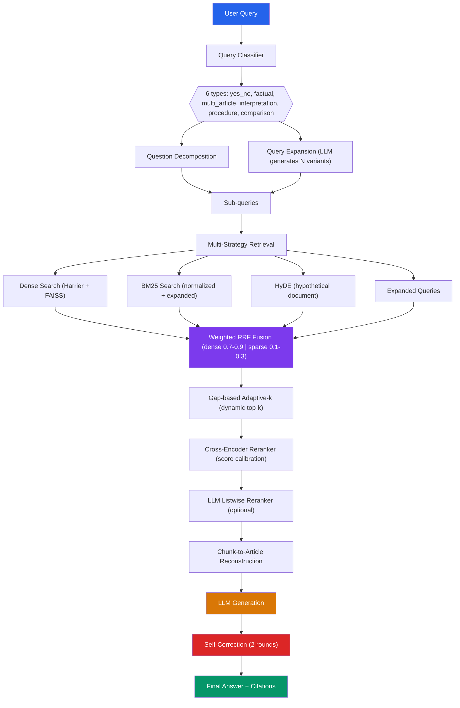

<p align="center">
  <h1 align="center">Legal RAG — AI Legal Assistant</h1>
  <p align="center">
    <em>Hệ thống Retrieval-Augmented Generation (RAG) mã nguồn mở cho luật pháp Việt Nam</em>
  </p>
  <p align="center">
    <a href="https://www.python.org/downloads/"></a>
    <a href="https://opensource.org/licenses/MIT"></a>
    <a href="https://huggingface.co/mainguyen9/vietlegal-harrier-0.6b"></a>
    <a href="https://github.com/YOUR_USER/YOUR_REPO"></a>
  </p>
</p>

---

## Mục lục

- [Quick Start](#quick-start)
- [Kiến trúc tổng quan](#kiến-trúc-tổng-quan)
- [Tính năng chính](#tính-năng-chính)
- [Cài đặt](#cài-đặt)
- [Hướng dẫn sử dụng](#hướng-dẫn-sử-dụng)
- [Cấu trúc project](#cấu-trúc-project)
- [Models](#models)
- [Nguồn dữ liệu](#nguồn-dữ-liệu)
- [Benchmarks](#benchmarks)
- [Đóng góp](#đóng-góp)
- [License](#license)

---

## Quick Start

```bash
# 1. Clone
git clone <repo-url>
cd legal-rag

# 2. Setup environment
conda create -n rag python=3.11 && conda activate rag
pip install -r requirements.txt

# 3. Tải index dữ liệu (~5GB)
python scripts/download_index_gdrive.py

# 4. Kiểm tra retrieval (không cần GPU mạnh)
python scripts/test_retrieval.py
```

> Chạy full pipeline với Gemma 4 qua Google API — không cần GPU lớn.

---

## Kiến trúc tổng quan



Mỗi câu hỏi được xử lý qua **6 giai đoạn**: phân loại → mở rộng → truy hồi đa chiến lược → xếp hạng lại → sinh câu trả lời → tự sửa lỗi.

> Xem chi tiết tại [`docs/ARCHITECTURE.md`](docs/ARCHITECTURE.md)

---

## Tính năng chính

| Tính năng | Mô tả |
|-----------|-------|
| **Hybrid Retrieval** | Dense (FAISS) + Sparse (BM25) + HyDE + Query Expansion |
| **Reranker 2 tầng** | Cross-encoder score calibration + LLM listwise reranker |
| **Agentic RAG** | LLM tự suy luận, đánh giá thiếu/đủ, truy vấn thêm (tối đa 2 vòng) |
| **Self-correction** | 2 vòng kiểm tra accuracy → sửa → rà soát lần cuối |
| **6 query types** | `yes_no`, `factual`, `multi_article`, `interpretation`, `procedure`, `comparison` |
| **Tiếng Việt** | Tokenizer chuyên biệt, normalization, legal abbreviation expansion |
| **2 chế độ LLM** | Prototyping (Gemma 4 API) + Offline inference (HuggingFace) |
| **RAM-efficient** | `LazyCorpus` load corpus bằng byte-offset, không giữ full RAM |
| **Benchmark** | Tích hợp sẵn F2-Macro, Recall@k, Precision@k |

---

## Cài đặt

### Yêu cầu

- **Python** 3.11+
- **RAM** 16GB+ (32GB+ để nạp full corpus)
- **GPU** (khuyến nghị): 8GB+ VRAM cho embedding & reranker
- **OS**: Linux / macOS / Windows (WSL2)

### 1. Clone & môi trường

```bash
git clone <repo-url>
cd legal-rag

# Khuyến nghị dùng conda
conda create -n rag python=3.11
conda activate rag
pip install -r requirements.txt
```

### 2. Tải Index dữ liệu

Index (FAISS + BM25) ~5GB được public trên Google Drive:

```bash
python scripts/download_index_gdrive.py
```

> Index đã build sẵn gồm **1,064,169 documents** với Harrier embedding 1024 chiều.

### 3. Cấu hình

Tạo file `.env`:

```env
# LLM prototyping (Gemma 4 qua Google API)
GOOGLE_API_KEY=your_google_api_key_here
GEMMA_MODEL=gemma-4-27b-it

# Embedding & Reranker (chạy local)
EMBEDDING_MODEL=mainguyen9/vietlegal-harrier-0.6b
RERANKER_MODEL=AITeamVN/Vietnamese_Reranker
DEVICE=cuda                        # hoặc cpu

# HuggingFace LLM (offline inference)
HF_MODEL_NAME=Qwen/Qwen3-8B-Instruct
HF_MODEL_DTYPE=bfloat16
```

---

## Hướng dẫn sử dụng

### Test nhanh RETRIEVAL (không cần LLM)

Phần retrieval là cốt lõi — test nhanh trên máy local với index đã build sẵn:

```bash
python scripts/test_retrieval.py
```

Script này dùng `LazyCorpus` nên **không nạp toàn bộ corpus vào RAM**.

### Chạy full pipeline với Gemma 4 (prototyping)

```python
import asyncio
from pathlib import Path
from src.data.loading import load_corpus
from src.pipeline.orchestrator import LegalRAGPipeline
from src.core.config import config

async def main():
    docs = load_corpus()
    pipeline = await LegalRAGPipeline.create(
        docs=docs,
        dense_path=str(Path(config.INDEX_DIR) / "dense.index"),
        sparse_path=str(Path(config.INDEX_DIR) / "sparse"),
    )
    result = await pipeline.answer("Người lao động có được hưởng lương thử việc không?")
    print(result.final_answer)
    print("Điều luật liên quan:", result.relevant_articles)

asyncio.run(main())
```

### Chạy offline với HuggingFace model

```bash
python scripts/run_pipeline.py
```

Hệ thống tự động dùng `HFClient` với model được cấu hình trong `HF_MODEL_NAME`.

---

## Cấu trúc project

```
.
├── src/
│   ├── core/               # Base classes (Adapter pattern), config
│   ├── data/               # Loader, chunking, filter
│   ├── embedding/          # Harrier embedding
│   ├── llm/                # Gemma4Client (API) + HFClient (offline)
│   ├── retrieval/          # FAISS + BM25 + HyDE + adaptive
│   ├── reranker/           # Cross-encoder reranker
│   ├── generator/          # Generation + self-correction
│   ├── pipeline/           # Orchestrator + Agentic RAG
│   └── evaluation/         # F2-Macro metrics
├── scripts/                # Tiện ích: test, download, evaluate
├── docs/                   # Tài liệu chi tiết
│   ├── 01_DATA.md          # Nguồn dữ liệu & chunking
│   ├── 02_RETRIEVAL_MODEL.md
│   ├── 03_RERANKER_MODEL.md
│   ├── 04_GENERATION_MODEL.md
│   └── ARCHITECTURE.md
├── data/
│   ├── indexes/            # FAISS + BM25 (tải về, ~5GB)
│   └── processed/          # Corpus JSONL (tải về)
├── research/               # Tham khảo từ các repo open-source
├── archive/                # Scripts cũ (competition-specific)
├── requirements.txt
└── README.md
```

> Xem file cấu trúc đầy đủ tại [`docs/ARCHITECTURE.md`](docs/ARCHITECTURE.md)

---

## Models

| Component | Prototyping (API) | Offline Inference | VRAM |
|-----------|-------------------|-------------------|------|
| **LLM** | `gemma-4-27b-it` (Google API) | `Qwen3-8B-Instruct` | ~6 GB (4-bit) |
| **LLM (backup)** | — | `thangvip/qwen3-4b-vietnamese-legal-grpo` | ~4 GB |
| **Embedding** | `vietlegal-harrier-0.6b` | Same | ~2 GB |
| **Reranker** | `AITeamVN/Vietnamese_Reranker` | Same | ~1.5 GB |

> **SOTA embedding**: `vietlegal-harrier-0.6b` đạt **NDCG@10 = 0.7813** trên Zalo Legal Benchmark.

---

## Nguồn dữ liệu

| # | Nguồn | Số lượng | Vai trò |
|---|-------|----------|---------|
| 1 | `phapdien-moj-gov-vn` | 202k điều luật | **Primary** — article-level |
| 2 | `th1nhng0/vietnamese-legal-documents` | 153k văn bản | Bổ trợ (metadata) |
| 3 | `UTS_VLC` | 318 bộ luật | Bổ trợ (toàn văn) |
| 4 | `PBGDPL Q&A` | 4.5k QA | Validation |
| 5 | `duyet/vietnamese-legal-instruct` | ~100k QA | Bổ trợ |
| 6 | `anle-toaan-gov-vn` | ~1k án lệ | Ngữ cảnh |

> Chi tiết: [`docs/01_DATA.md`](docs/01_DATA.md)

---

## Benchmarks

### F2-Macro (metric chính)

```python
from src.evaluation.metrics import compute_f2_macro

y_true = [["25", "26"], ["123"]]
y_pred = [["25"], ["123", "124"]]
results = compute_f2_macro(y_true, y_pred)
# { "macro_f2": 0.583, "micro_precision": 0.667, "micro_recall": 0.500, ... }
```

**beta=2** → recall được coi trọng gấp đôi precision. Chiến lược:
- **Recall-first**: multi-query, HyDE, large top-k
- **Precision cuối**: score threshold >0.95, reranker

### Chạy benchmark

```bash
# Đánh giá retrieval + generation qua Google API (prototyping)
python scripts/evaluate_vlsp2025.py --client gemma

# Đánh giá offline với HuggingFace model
python scripts/evaluate_vlsp2025.py --client hf

# Chạy tất cả benchmarks
python scripts/run_all_benchmarks.py
```

---

## Đóng góp

Mọi đóng góp đều được hoan nghênh!

1. Fork repo
2. Tạo branch feature (`git checkout -b feature/amazing-feature`)
3. Commit changes (`git commit -m 'Add amazing feature'`)
4. Push lên branch (`git push origin feature/amazing-feature`)
5. Mở Pull Request

Xin đảm bảo code có type hints và pass các typecheck cơ bản.

---

## License

MIT © 2026 — Xem file [LICENSE](LICENSE) để biết thêm chi tiết.

---

<p align="center">
  <sub>Built for Vietnamese legal tech.</sub>
</p>
