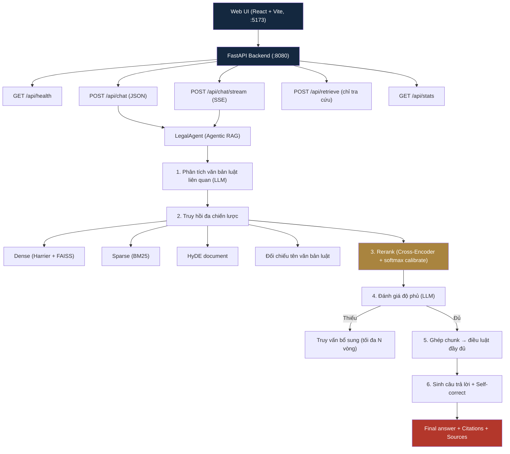

<p align="center">
  <h1 align="center">LegalRAG — Trợ lý Pháp lý AI cho Việt Nam</h1>
  <p align="center">
    <em>Hệ thống RAG + Agentic Retrieval tra cứu và trả lời câu hỏi pháp luật Việt Nam, kèm Web UI &amp; API hoàn chỉnh</em>
  </p>
  <p align="center">
    <a href="https://www.python.org/downloads/"></a>
    <a href="https://fastapi.tiangolo.com/"></a>
    <a href="https://react.dev/"></a>
    <a href="https://huggingface.co/mainguyen9/vietlegal-harrier-0.6b"></a>
    <a href="https://github.com/noskaiser2310/AI_RAG_LEGAL"></a>
  </p>
</p>

---

## Mục lục

- [Giới thiệu](#giới-thiệu)
- [Kiến trúc tổng quan](#kiến-trúc-tổng-quan)
- [Tính năng chính](#tính-năng-chính)
- [Yêu cầu hệ thống](#yêu-cầu-hệ-thống)
- [Cài đặt](#cài-đặt)
- [Cấu hình](#cấu-hình)
- [Chạy hệ thống (Product)](#chạy-hệ-thống-product)
- [API Reference](#api-reference)
- [Cấu trúc project](#cấu-trúc-project)
- [Models & Nguồn dữ liệu](#models--nguồn-dữ-liệu)
- [Benchmark VMTEB (thư mục evaluate/)](#benchmark-vmteb-thư-mục-evaluate)
- [Xử lý sự cố](#xử-lý-sự-cố)
- [Đóng góp](#đóng-góp)
- [License](#license)

---

## Giới thiệu

**LegalRAG** là hệ thống trợ lý pháp lý AI dành cho doanh nghiệp SME và cá nhân tại Việt Nam. Hệ thống tra cứu trực tiếp trong kho **1.06 triệu điều khoản pháp luật** (Pháp điển, Thư viện pháp luật, v.v.), xếp hạng lại bằng reranker chuyên biệt tiếng Việt, và tổng hợp câu trả lời có **trích dẫn điều luật cụ thể** kèm mức độ tin cậy.

Khác với các hệ RAG đơn giản, LegalRAG có:

- **Agentic retrieval**: LLM phân tích câu hỏi → xác định văn bản luật liên quan → truy vấn nhiều vòng, tự đánh giá độ phủ và truy vấn bổ sung nếu thiếu.
- **Web UI chuyên nghiệp** (React + Vite) với streaming, trích dẫn nguồn, thống kê thời gian từng giai đoạn.
- **API REST** (FastAPI) dễ tích hợp vào ứng dụng khác.
- **Bộ benchmark VMTEB-ALQAC** tách riêng trong `evaluate/`, không trộn lẫn vào code product.

---

## Kiến trúc tổng quan



### 6 giai đoạn xử lý một câu hỏi

1. **Phân tích** — LLM xác định lĩnh vực pháp luật, văn bản luật có thể áp dụng, và tạo 2-3 truy vấn tìm kiếm.
2. **Truy hồi đa chiến lược** — song song: dense search (Harrier 1024-chiều + FAISS), BM25, HyDE (cho câu hỏi tình huống), đối chiếu tên luật qua `LawNameIndex`, trọng số hybrid động theo loại câu hỏi (keyword cứng → BM25 0.7; tình huống → dense 0.7).
3. **Rerank** — Cross-Encoder `AITeamVN/Vietnamese_Reranker`, softmax + min-max calibrate về [0,1].
4. **Đánh giá độ phủ** — LLM chấm điểm: đủ/thiếu, confidence, gaps; nếu thiếu → tạo follow-up queries và truy vấn thêm (agentic loop).
5. **Tái cấu trúc** — các chunk rời ghép lại thành điều luật đầy đủ (`Điều X` hoàn chỉnh thay vì mảnh vụn).
6. **Sinh + tự sửa** — generation với prompt chuyên ngành pháp lý, 2 vòng self-correction, final editor dọn format, trích xuất citations.

> Chi tiết kỹ thuật từng tầng: xem `src/pipeline/agent.py`, `src/pipeline/orchestrator.py`, `src/retrieval/*`, `src/generator/generator.py`.

---

## Tính năng chính

| Tính năng | Mô tả |
|-----------|-------|
| **Web UI chuyên nghiệp** | React + Vite: sidebar lịch sử, streaming, citations panel, confidence bar, metrics từng giai đoạn, dark/light theme |
| **API REST + SSE** | FastAPI, đầy đủ `health`, `chat`, `chat/stream`, `retrieve`, `stats` |
| **Agentic RAG** | LLM tự phân tích, truy vấn nhiều vòng, đánh giá độ phủ, self-correction |
| **Hybrid Retrieval** | Dense (FAISS) + Sparse (BM25) + HyDE + Query Expansion + đối chiếu tên văn bản |
| **Reranker tiếng Việt** | Cross-Encoder calibrated score trong [0,1] |
| **Tái cấu trúc điều luật** | Ghép chunk rời → điều luật đầy đủ trước khi sinh câu trả lời |
| **Tiếng Việt chuyên biệt** | Normalization, legal abbreviation expansion, segmentation cho BM25 |
| **RAM-efficient** | `LazyCorpus` (byte-offset) không nạp toàn bộ corpus vào RAM |
| **Benchmark tách riêng** | `evaluate/` — VMTEB-ALQAC: F2-Macro, Recall@k, MRR, batch + resume |
| **Cache model local** | Ưu tiên load từ HF cache, không gọi remote mỗi lần khởi động |

---

## Yêu cầu hệ thống

| Thành phần | Yêu cầu tối thiểu | Khuyến nghị |
|------------|--------------------|-------------|
| Python | 3.11+ | 3.11/3.12 |
| Node.js | 18+ | 20+ (cho frontend) |
| RAM | 16 GB | 32 GB |
| GPU | CPU-only có thể chạy (chậm) | 8 GB+ VRAM (embedding 2.3 GB + reranker 2.2 GB) |
| LLM | Gemini API key (không cần GPU) | — |
| Dữ liệu | corpus ~1.06M docs + indexes (~5 GB disk) | SSD |

---

## Cài đặt

### 1. Clone & môi trường Python

```bash
git clone https://github.com/noskaiser2310/AI_RAG_LEGAL.git
cd AI_RAG_LEGAL

# Khuyến nghị dùng conda/venv
conda create -n legalrag python=3.11 -y
conda activate legalrag
pip install -r requirements.txt
```

> `requirements.txt` đã bao gồm `fastapi` + `uvicorn` cho backend.

### 2. Dữ liệu & Index

Corpus và index được tải qua **Kaggle Dataset** (không commit vào repo do dung lượng):

```
data/
├── processed/corpus.jsonl   # 1,064,169 docs (pháp điển, luật, nghị định, thông tư...)
├── indexes/dense.index      # FAISS dense index (Harrier, dim 1024)
└── indexes/sparse/          # BM25 index (bm25s)
```

- **Đã có sẵn local**: copy/thêm từ dataset vào thư mục `data/` như trên.
- **Chưa có**: chạy build từ đầu (tốn thời gian, cần tải datasets HF):
  ```bash
  python -c "
  from src.data.loading import build_corpus
  docs = build_corpus(force_rebuild=True)   # tải 6 nguồn HF + dedup
  print(len(docs))
  "
  ```
  Index: `python -m evaluate.evaluate_vmteb_batch --help` hoặc dùng notebook Kaggle `kaggle_benchmark_vmteb.ipynb` (build corpus → encode → build indexes → save).

### 3. Cài frontend

```bash
cd frontend
npm install
npm run build        # (tùy chọn) kiểm tra build production
cd ..
```

---

## Cấu hình

Tạo file `.env` từ template:

```bash
cp .env.example .env
```

```env
# ===== Google Gemini (LLM - bắt buộc để chat) =====
GOOGLE_API_KEY=your_gemini_api_key_here
GEMINI_MODEL=gemini-2.0-flash

# ===== Models =====
EMBEDDING_MODEL=mainguyen9/vietlegal-harrier-0.6b
EMBEDDING_DIM=1024
RERANKER_MODEL=AITeamVN/Vietnamese_Reranker

# ===== Hardware =====
DEVICE=cuda          # hoặc cpu

# ===== Retrieval =====
BM25_K1=1.5
BM25_B=0.75
RETRIEVAL_TOP_K=500
RERANK_TOP_K=50
FINAL_TOP_K=20
SCORE_THRESHOLD=0.7

# ===== Generation =====
MAX_TOKENS=8192
TEMPERATURE=0.1

# ===== Paths =====
DATA_DIR=data
INDEX_DIR=data/indexes
```

> Nếu không có `GOOGLE_API_KEY`, API vẫn trả lời nhưng dùng bộ key mặc định tích hợp (giới hạn rate). Khuyến nghị luôn dùng key riêng.

---

## Chạy hệ thống (Product)

### Bước 1 — Backend API (port 8080)

```bash
python -m uvicorn api.main:app --host 0.0.0.0 --port 8080
```

- Lần đầu chạy sẽ **load corpus + 2 model (embedding, reranker) + 2 index**, mất 1–3 phút tùy máy.
- Gọi `GET http://localhost:8080/api/health` và chờ `"status": "ready"`.

### Bước 2 — Web UI (port 5173)

```bash
cd frontend
npm run dev
```

Mở trình duyệt: **http://localhost:5173**

Vite tự proxy mọi request `/api/*` sang `http://127.0.0.1:8080` (xem `frontend/vite.config.ts` — đổi target nếu backend chạy máy khác).

### Bước 3 — Sử dụng

1. Nhập câu hỏi pháp lý (VD: *"Doanh nghiệp bị sao chép phần mềm trái phép thì xử lý thế nào?"*) hoặc bấm một gợi ý sẵn.
2. Xem trạng thái từng giai đoạn (tra cứu → tổng hợp), kết quả với **trích dẫn điều luật**.
3. Mở panel **"Điều luật trích dẫn"** để xem nguồn & nội dung từng điều, bấm để xem đầy đủ.
4. Thanh bên trái lưu lịch sử tự động (localStorage), có dark mode.

---

## API Reference

Base URL: `http://localhost:8080`

### `GET /api/health`

Trạng thái hệ thống + thông tin model.

```json
{
  "status": "loading | ready | error",
  "app": "LegalRAG",
  "corpus_docs": 1064169,
  "dense_index_vectors": 1064169,
  "sparse_index_docs": 1064169,
  "llm_backend": "gemini",
  "llm_model": "gemini-2.0-flash",
  "device": "cuda",
  "embedding_model": "mainguyen9/vietlegal-harrier-0.6b",
  "reranker_model": "AITeamVN/Vietnamese_Reranker"
}
```

### `GET /api/stats`

Thống kê corpus: số docs theo nguồn, số điều có `article_id`/`so_ky_hieu`, top 15 văn bản nhiều chunk nhất.

### `POST /api/chat`

Trả lời câu hỏi (JSON đầy đủ). **Body:**

```json
{
  "query": "Thủ tục đăng ký thành lập công ty TNHH?",
  "mode": "agentic",
  "use_self_correct": true,
  "max_iterations": 2
}
```

**Response** (rút gọn):

```json
{
  "query": "...",
  "query_type": "agentic",
  "answer": "Theo Điều 22 Luật Doanh nghiệp 2020, ...",
  "citations": ["Điều 22 Luật Doanh nghiệp 2020"],
  "relevant_articles": ["60/2020/QH14|Luật Doanh nghiệp 2020|22"],
  "confidence": 0.98,
  "retrieval_time": 3.2,
  "rerank_time": 1.1,
  "generation_time": 6.5,
  "total_time": 10.8,
  "num_correction_rounds": 1,
  "chunks": [
    {
      "chunk_id": "...",
      "doc_title": "Luật Doanh nghiệp 2020",
      "article_id": "22",
      "content": "...",
      "score": 0.98,
      "source": "reconstructed",
      "metadata": { "so_ky_hieu": "60/2020/QH14" }
    }
  ]
}
```

### `POST /api/chat/stream`

Tương tự `/api/chat` nhưng **Server-Sent Events** (cho UI streaming):

```
event: stage
data: {"name":"starting","message":"Khởi tạo hệ thống..."}

event: done
data: { ...ChatResponse... }
```

### `POST /api/retrieve`

Chỉ tra cứu + rerank (không gọi LLM sinh câu trả lời). Body: `{"query": "...", "top_k": 20}` → trả `chunks` đã tái cấu trúc điều luật.

---

## Cấu trúc project

```
.
├── api/                        # Backend FastAPI (Product)
│   ├── main.py                 # Endpoints: health, chat, chat/stream, retrieve, stats
│   ├── state.py                # AppState: lazy singleton (corpus, models, indexes, pipeline)
│   └── schemas.py              # Pydantic request/response
├── frontend/                   # Web UI (React + Vite + TypeScript)
│   ├── src/App.tsx             # State, history (localStorage), SSE client
│   ├── src/api.ts              # Fetch + SSE parser
│   ├── src/components/         # ChatMessage, Composer, Markdown
│   └── src/styles/global.css   # Design system (ivory/navy/brass theme)
├── evaluate/                   # Benchmark VMTEB-ALQAC (tách riêng khỏi product)
│   ├── evaluate_vmteb_batch.py # Eval 1 batch, incremental save
│   ├── evaluate_vmteb_resume.py# Resume/retry batch lỗi
│   ├── run_all_batches.py      # Chạy 13 batch tuần tự + summary
│   ├── package_results.py      # Zip kết quả đóng gói
│   ├── package_kaggle_models.py# Đóng gói model lên Kaggle dataset
│   └── package_kaggle_data.py  # Đóng gói corpus + index
├── src/                        # Lõi RAG (dùng chung product + evaluate)
│   ├── core/                   # base.py (abstract), config.py (pydantic-settings), cache.py
│   ├── data/                   # loading.py (6 nguồn + build_corpus), filtering, article_extractor
│   ├── embedding/              # HarrierEmbedding (last-token pool)
│   ├── llm/                    # gemini_parallel.py (multi-key), hf_client.py
│   ├── retrieval/              # indexing (FAISS+BM25), multi_strategy, hyde, adaptive, query_expansion, chunking, segmentation
│   ├── reranker/               # cross_encoder.py (CE + LLM + 2-stage)
│   ├── generator/              # generator.py (prompt pháp lý + self-correct + final edit)
│   ├── pipeline/               # agent.py (LegalAgent), orchestrator.py
│   └── evaluation/             # metrics.py (F2-macro, Recall@k, MRR)
├── data/                       # corpus + indexes + results (gitignored, tải riêng)
├── kaggle_benchmark_vmteb.ipynb# Notebook chạy benchmark trên Kaggle
├── requirements.txt
└── README.md
```

> `reference/`, `research/`, `docs/`, `temp/`, `archive/` — tài liệu tham khảo nội bộ, không commit lên GitHub.

---

## Models & Nguồn dữ liệu

### Models

| Component | Model | Vai trò |
|-----------|-------|---------|
| **LLM** | `GEMINI_MODEL` (mặc định `gemini-2.0-flash`) | Phân tích, sinh câu trả lời, self-correction |
| **Embedding** | `mainguyen9/vietlegal-harrier-0.6b` (1024 chiều) | Dense search — SOTA trên Zalo Legal Benchmark |
| **Reranker** | `AITeamVN/Vietnamese_Reranker` | Cross-encoder rerank tiếng Việt |

Cả embedding và reranker đều tự động tải từ HuggingFace về `hf_cache/` lần đầu, sau đó load từ local cache (xem `src/core/cache.py`).

### Nguồn dữ liệu (build_corpus)

| # | Nguồn | Vai trò |
|---|-------|---------|
| 1 | `tmquan/phapdien-moj-gov-vn` | Primary — điều luật Pháp điển |
| 2 | `vohuutridung/vietnamese-legal-documents` | Thư viện pháp luật (article extraction) |
| 3 | `th1nhng0/vietnamese-legal-documents` | VBPL legacy |
| 4 | `undertheseanlp/UTS_VLC` | Toàn văn 318 bộ luật |
| 5 | `KienCute/legal-pretrain` | Legal pretrain corpus |
| 6 | `tmquan/pbgdpl-vn-legal-qna` | PBGDPL Q&A |

Pipeline xử lý: làm sạch → enrich `so_ky_hieu` → chunk theo cấu trúc điều luật → dedup → lọc ngắn (<30 từ) → `corpus.jsonl`.

---

## Benchmark VMTEB (thư mục evaluate/)

Toàn bộ code benchmark nằm riêng trong `evaluate/`, không ảnh hưởng product. Benchmark dùng **VMTEB-ALQAC retrieval** (`another-symato/VMTEB-ALQAC-retrieval`, 620 queries), metric chính **Micro-F2** (recall ưu tiên gấp đôi precision) + Recall@k + MRR.

### Chạy 1 batch (test nhanh)

```bash
python -m evaluate.evaluate_vmteb_batch --batch-idx 0 --batch-size 5 --workers 1 --llm gemini
```

### Chạy full 13 batch

```bash
python -m evaluate.run_all_batches --start 0 --end 12 --llm gemini
# --llm hf --hf-model Qwen/Qwen2.5-7B-Instruct  (chạy local, workers=1)
```

- Script tự **skip batch đã xong** (`data/results/vmteb_batchN_metrics.json`).
- Mỗi query ghi **incremental** vào `vmteb_batchN_partial.jsonl` — session chết không mất dữ liệu.
- Resume query lỗi:

```bash
python -m evaluate.evaluate_vmteb_resume --batch-idx N --batch-size 50
```

### Kết quả & đóng gói

- Output: `data/results/vmteb_batchN_{metrics,detail,trace}.json`
- Zip kết quả: `python -m evaluate.package_results`
- Đóng gói model/data lên Kaggle dataset: `python -m evaluate.package_kaggle_models`, `python -m evaluate.package_kaggle_data`

> **Khuyến nghị**: benchmark chạy trên Kaggle GPU qua `kaggle_benchmark_vmteb.ipynb` (notebook đã cập nhật gọi `evaluate.*`).

---

## Xử lý sự cố

| Vấn đề | Nguyên nhân & cách xử lý |
|--------|--------------------------|
| `GET /api/health` trả `loading` mãi | Lần đầu tải model từ HF Hub (tốc độ mạng). Chờ 1–3 phút; check log backend. |
| Chat trả lỗi 500 | Thiếu/ hết hạn `GOOGLE_API_KEY` → cập nhật `.env` và restart backend. |
| Model treo khi load | Mạng bị chặn HF → model chưa cache. Đảm bảo đã tải đủ model về `hf_cache/` (hoặc set `HF_HUB_OFFLINE=1` khi đã có cache). |
| Frontend không gọi được API | Vite proxy trỏ `127.0.0.1:8080` — nếu backend chạy port khác, sửa `frontend/vite.config.ts` rồi restart `npm run dev`. |
| Port bị chiếm | `netstat -ano | findstr :8080` → kill PID đang listen, hoặc đổi port trong lệnh uvicorn + vite.config. |
| RAM không đủ | Product dùng `LazyCorpus` (không nạp full corpus). Giảm `RETRIEVAL_TOP_K` nếu cần. |
| CPU chạy chậm | Model 0.6B embedding + reranker trên CPU khá chậm; khuyến nghị GPU. Chế độ `--llm hf` chỉ dùng cho benchmark offline. |

---

## Đóng góp

Mọi đóng góp đều được hoan nghênh:

1. Fork repo
2. Tạo branch feature (`git checkout -b feature/amazing-feature`)
3. Commit changes (`git commit -m 'Add amazing feature'`)
4. Push lên branch (`git push origin feature/amazing-feature`)
5. Mở Pull Request

Quy ước:
- Code product (API + src) không phụ thuộc `evaluate/`.
- Không commit `.env`, `data/`, `hf_cache/`, `temp/`.
- Không import `gemini_parallel.py` các key vào file mới — key chỉ qua `.env`.

---

## License

MIT © 2026

---

<p align="center">
  <sub>Built for Vietnamese legal tech — R2AI2026 BUILD AI LEGAL ASSISTANT</sub>
</p>
